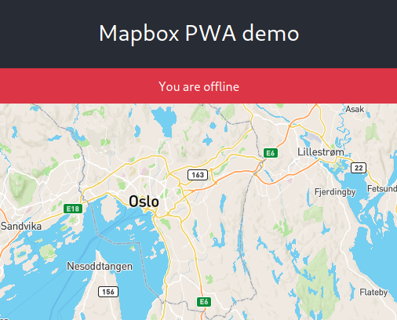

# Hackaton Bryggegaten 9

Start: 2019-11-09, 09:00
End: 2019-11-10, 19:00
Duration: 34 hours
Individual project by Jonas Johan Solsvik, 16HBPROGA

## Log

### Sunday

#### 14:50 - Store state in localStorage

- Use localStorage to save state between reloads

**Getting**
```javascript
...JSON.parse(window.localStorage.getItem('map-options') || {
    center: [10.8358, 59.7195],
    zoom: 9,
}),
```

**Storing**
```javascript
window.localStorage.setItem('map-options', JSON.stringify({
    center: this.state.map.getCenter(),
    zoom: this.state.map.getZoom(),
}));
```


#### 13:52 - Serviceworker cookbook

- https://serviceworke.rs/

#### 11:50 - Splash screen generator

- appscopes splash screen generator - https://appsco.pe/developer/splash-screens

#### 11:10 - Good morning repo

### Saturday

#### 22:30 - Attempt at adding splashscreen

- No sucess yet on iOS. Android untested.
- Adding a special apple link meta `<head>`  tag, with no luck
```html
<link 
    rel="apple-touch-startup-image" 
    href="splashscreen.png" 
    media="(device-width: 320px) and (device-height: 568px) and (-webkit-device-pixel-ratio: 2) and (orientation: portrait)"
>
<link 
    rel="apple-touch-startup-image" 
    href="splashscreen.png" 
    media="(device-width: 375px) and (device-height: 667px) and (-webkit-device-pixel-ratio: 2) and (orientation: portrait)"
>
```

#### 22:00 - Add message when you go offline

Using the two events `offline` and `online`, I am able to tell the user if he is disconnect or not.

```javascript
window.addEventListener('online', this.updateConnectionStatus)
window.addEventListener('offline', this.updateConnectionStatus)
```




#### 20:35 - Checking out how to enable offline maps

- github.io example of offline maps - http://klokantech.github.io/mapbox-gl-js-offline-example/
- github.com example repo https://github.com/klokantech/mapbox-gl-js-offline-example

#### 20:00 - Installing the pwa app on the homescreen of an iphone


#### 19:00 - Got a tips on how I can beat the native team
- Hett tips fra PREG! Reduser draw-calls. Bruk polylines
- Savner WebGL 2.0. Apple må få fingern ut av ræva.

#### 18:00 - Gathering relevant links to work with mapbox

- Custom mapbox layers for rendering wind - https://github.com/astrosat/windgl
- Mapbox GL JS API reference - https://docs.mapbox.com/mapbox-gl-js/api/
- How to use mapbox GL with React - https://blog.logrocket.com/how-to-use-mapbox-gl/
- React-map-gl component - https://uber.github.io/react-map-gl/#/
- Example project from Morten in Maritime Optima - https://github.com/MaritimeOptima/mapbox-weather-viewer/blob/master/examples/react-mapbox/src/components/Map.js

#### 17:00 - setting up React devenv

- Using facebooks script for setting up a pre-configured react environment - https://github.com/facebook/create-react-app


#### 10:00 - Brainstorming

- Discussing several ideas.
- Divying up into groups.
- I'm working in my own repo, but am going to present to the rest of the participanty

**Constraints**
- Use React as a frontend framework
- Use Mapbox for displaying maps
- Main mission is to create a test, to test if using a PWA app is "good enough" for a special use case.
- Another group is solving the same problem, but trying to use Mapbox native SDK.
- Basically my project is about proving, that the other group is wasting their time, having separate code bases for each platform.

### Sunday


