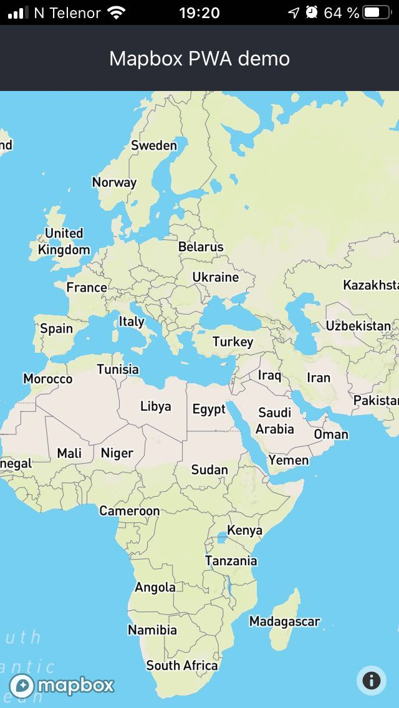

# Hackaton Bryggegaten 9

Start: 2019-11-09, 09:00
End: 2019-11-10, 19:00
Duration: 34 hours
Individual project by Jonas Johan Solsvik, 16HBPROGA

## Log

### Saturday

#### 20:00 - Installing the pwa app on the homescreen of an iphone

#### 19:00 - Got a tips on how I can beat the native team
- Hett tips fra PREG! Reduser draw-calls. Bruk polylines
- Savner WebGL 2.0. Apple må få fingern ut av ræva.

#### 18:00 - Gathering relevant links to work with mapbox

- Custom mapbox layers for rendering wind - https://github.com/astrosat/windgl
- Mapbox GL JS API reference - https://docs.mapbox.com/mapbox-gl-js/api/
- How to use mapbox GL with React - https://blog.logrocket.com/how-to-use-mapbox-gl/
- React-map-gl component - https://uber.github.io/react-map-gl/#/
- Example project from Morten in Maritime Optima - https://github.com/MaritimeOptima/mapbox-weather-viewer/blob/master/examples/react-mapbox/src/components/Map.js

#### 17:00 - setting up React devenv

- Using facebooks script for setting up a pre-configured react environment - https://github.com/facebook/create-react-app

#### 10:00 - Brainstorming

- Discussing several ideas.
- Divying up into groups.
- I'm working in my own repo, but am going to present to the rest of the participanty

**Constraints**
- Use React as a frontend framework
- Use Mapbox for displaying maps
- Main mission is to create a test, to test if using a PWA app is "good enough" for a special use case.
- Another group is solving the same problem, but trying to use Mapbox native SDK.
- Basically my project is about proving, that the other group is wasting their time, having separate code bases for each platform.

### Sunday

